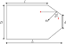

# Diffuse Particle Rebound in Conical Section

   
   

## Parametrization of the geometry

The following four variables have been choosen to parametrice the geometry of the conical section:

   

* The diameter of the outlet $d$
* The diameter of the section $D$
* The length of the channel $L$
* The conical section beginnig $l$

These four variables completely define the computational domain.

## Model simplifications
* Collisions will be consider elastic. This implies that the kinetic energy is conserved in each of the rebounds.

* The outlet position is always symmetric to the median plane.

* The particles do not collision between them. I.e the movement of each of the particles are independent between them.

* The particles only rebound with the conical section. This means that if the particles rebounds towards the upper, lower or inlet wall they get glued on them.

## Diffuse reflexion model
In diffuse rebound models, the particle is reflected with a random distribution of direction which follows the Knusden cosine law. This is: the rebound angle is a random variable with a probability density function

$$
P(\theta) = \cos(\theta).
$$

 $\theta$ being the angle measure taking as reference the normal direction (see figure of below), the most probable rebound direction is the normal to the wall i.e: $\theta=0º$.

   

 However, with the last probability density function, only angles between $0$ and $\pi/2$ can be obtained, since we want also rebound angles above the normal vector i.e  -$\pi/2$ and $\pi/2$ direction, the probability density function should be modified as follows:

$$
P(\theta) = \frac{1}{2}\cos(\theta),
$$

 To compute the random angle using an uniform distribution let us calculate the cumulative density function:

$$F(\theta)=\int_{-\pi/2}^{\theta}\frac{1}{2}\cos(t)\,\mathrm{d}t = \frac{\sin(\theta)+1}{2}.$$

Now, taking an inverse transform of the sampling being $u=F(\theta)$ and $u\in[0,1]$, it gives:

$$\theta=\arcsin\left(2u-1\right).$$

Mapping an uniform random variable between 0 and 1 the previous function maps an angle of rebound between $-\pi/2$ and $\pi/2$

## Initial particle distribution
TODO

## Possible rebounds in the domain

### Condition for pass through the outlet

The output condition can be evaluated by looking to the absolute rebound angle $\theta_{\mathrm{abs}}$ (measured from the horizontal) and the absoulute feasible angle $\gamma_{\mathrm{abs}}$ that dictates if a particle reaches or not the outlet. For the top part of the conical section, looking to the picture of below

   

For the bottom part of the conical section, looking also to the picture of below

   

For both cases the output condition can be written as follows:

$$\theta> \pi/2 - \gamma.$$

For both cases $\gamma$ can be computed using the law of cosines as follows:

$$\gamma = \arccos\left(\frac{a^2+b^2-d^2}{2ab}\right),$$

and $\alpha$ is just simply

$$\alpha = \arctan\left(\frac{(D-d)/2}{L-l}\right).$$

### Condition for rebound with the other conical wall

TODO

### Condition for reach the upper wall of the domain

TODO

### Condition for reach the lower wall of the domain
TODO

with $\theta_{\mathrm{abs}}$ and $\gamma_{\mathrm{abs}}$ been calculated as follows:

$$\theta_{\mathrm{abs}} = \frac{3\pi}{2} - \alpha + \theta,$$

$$\gamma_{\mathrm{abs}} = 2\pi - (\alpha + \gamma),$$

with $\theta_{\mathrm{abs}}$ and $\gamma_{\mathrm{abs}}$ been calculated as follows:

$$\theta_{\mathrm{abs}} = \frac{\pi}{2} + \alpha - \theta,$$

$$\gamma_{\mathrm{abs}} = \alpha + \gamma.$$

## Compute position rebounds
All the mathematical equations of the boundaries are known, they are simply straigth lines. At the same time, the kinematics of the particle is also known, so is straightforward to compute in which position of the boundary the particle will collide.

$$x(t) = x_0 + v_xt$$
$$y(t) = y_0 + v_yt$$

### Outlet
The outlet boundary has equation $x=L$, so equating the equation governing the kinematics of the particle in the x-direction with this equation the time at which the particle reach the outlet can be obtained:

$$t = \frac{L-x_0}{v_x}$$

### Upper conical section
TODO

### Lower conical secction
TODO
### Lower wall
The lower boundary has equation $y=0$, so equating the equation governing the kinematics of the particle in the y-direction with this equation the time at which the particle reach the inlet can be obtained:

$$t = \frac{-y_0}{v_y}$$
### Upper wall

The upper boundary has equation $y=D$, so equating the equation governing the kinematics of the particle in the y-direction with this equation the time at which the particle reach the inlet can be obtained:

$$t = \frac{D-y_0}{v_y}$$

### Inlet
The inlet boundary has equation $x=0$, so equating the equation governing the kinematics of the particle in the x-direction with this equation the time at which the particle reach the inlet can be obtained:

$$t = \frac{-x_0}{v_x}$$

## Metrics to compute the particle flow

I consider this point the key point of the problem. I defined the problem to inyect particles only once. So defining this measure is slighty complicated since you don't know a priori what will be time taken to all the particles leave the domain, and consequently, you don't have a reference time. Two main metrics have been defined:

* The first method is based on the time taken for the last particle to exit the domain. In practice, the exit time for each particle is recorded, and the maximum time $T$ is used as rference

   $$m = \frac{N}{T}$$
   
    $N$ being the total number of particles that reach the outlet. While this metric is easy to compute, it has a significant drawback: if a particle gets stuck rebounding off the conical wall, the output particle rate is greatly underestimated and this may not accurately reflect the true dynamics of the flow.

* The other one is based on the mean-interval arrival time. That is: the average time difference between consecutive particle exits and then take its inverse:

   $$\mathrm{MIAT} = \frac{1}{N-1}\sum_{i=1}^{N-1}(T_{i+1}-T_i)$$
   The previous measure of how many seconds are taken between two consecutive particles to reach the outlet [s/particle], so taking the inverse of this indicator an estimation can be calculated  
   $$m = \frac{1}{\mathrm{MIAT}}$$
   this metric manage in a better way the situation of a particle getting stuck rebounding off the conical wall. Since it takes an average of all the mean-interval arrival times, the stuck situation is damped. This metric has also drawbacks: for example if all the particles reach the outlet at the same time this metric goes to infinity. This situation could happen if the configuration choosen is composed only of particles at the same height of outlet on the inlet.

* TODO: make a metric that is a combination of mean-inter-arrival times for particle that get stuck rebouding and another one taking into account the number of particles that automatically leave the domain.

## Algorithm 
The algorithm to measure the particles flow can be summarized as follows:
1. Compute the time taken to the particle to reach the conical section, where the rebound is poduced.

2. Compute the random angle of rebound when the particle reachs the surface by using the Knusden cosine law.

3. Evaluate the output condition. If condition is fulfilled compute the time taken to the particle to reach the outlet and add one to the particle counter.

4. If the particle not satisifies the previous condition, evaluate if it new trayectory make it rebound with the other conicall wal. If condition is fullfilled compute the point of the other conical wall where particle collides and compute new angle of rebound. 

5. Repeat 4 until either the outlet is reached or the rebound causes the particle to collide again with the other conical wall.

6. If none of the two previous conditions are fulfilled compute with which of the walls the particles collides and keep it glued to that wall. 

7. Compute particle flow with one of the two measures defined above.